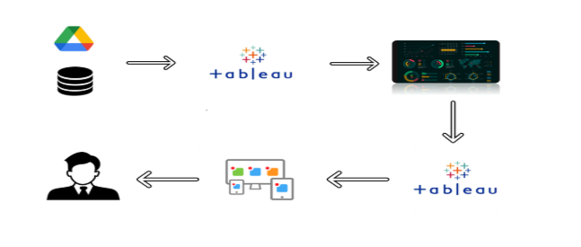

# Food Ordering Behaviour and Consumer Trends: A Structured Analysis of Choices and Habits

[](https://public.tableau.com/views/FoodOrderingBehaviourandConsumerTrend_Huzaifa/Dashboard1?:language=en-US&:display_count=n&:origin=viz_share_link)
[](LICENSE)
[](validate_workbook.py)
[](docs/data-preparation.md)
[](https://github.com/Huzaifa2526)

---

### Quick Links & Navigation

| [Live Demo Website](https://huzaifa2526.github.io/SkillWallet/) | [Tableau Public Live Viz](https://public.tableau.com/views/FoodOrderingBehaviourandConsumerTrend_Huzaifa/Dashboard1?:language=en-US&:display_count=n&:origin=viz_share_link) | [GitHub Repository](https://github.com/Huzaifa2526/SkillWallet) | [Demonstration Video](https://drive.google.com/file/d/1EGqiZxYGsHgL8gLxxz74CgU6mHn7xiiN/view?usp=sharing) | [Documentation Suite](docs/) |
| :---: | :---: | :---: | :---: | :---: |

---

## 1. Project Overview

The on-demand food delivery industry operates under intense competitive dynamics characterized by shifting consumer preferences, varying price elasticities, and operational fulfillment complexities. Understanding granular ordering patterns, spending behavior, meal timing, and delivery transit consistency is paramount for platform profitability and customer retention.

This project delivers a comprehensive Business Intelligence (BI) and Visual Analytics solution developed in **Tableau**, analyzing **50,000 transaction records** across major Indian metropolitan centers. Raw data is transformed into decision-ready executive KPIs, multidimensional visualizations, an interactive composite dashboard (`Dashboard 1`), and a structured analytical story (`Story 1`).

---

## 2. Problem Statement

Food delivery aggregators and restaurant partners struggle with:
1. **Demand Volatility:** Severe demand swings between lunch and dinner meal slots and between individual versus corporate orders.
2. **Geographical Taste Divergence:** Distinct culinary preferences across Tier-1 metropolitan markets (e.g., Bangalore, Delhi, Mumbai, Hyderabad, Pune, Chennai).
3. **Delivery Transit Predictability:** Maintaining fulfillment service level agreements (SLAs) without driving down customer satisfaction ratings.
4. **Demographic Misalignment:** Misallocated discount budgets due to a lack of granular demographic segmentation across consumer age groups and dining segments.

---

## 3. Project Objectives

- **Consolidate & Audit:** Ingest and profile 50,000 empirical transaction records, ensuring zero missing values in primary dimensions and strict data type adherence.
- **Analyze Demand & Revenue Drivers:** Uncover geographic hotspots, culinary affinities, and meal-type revenue distributions.
- **Evaluate Operational Stability:** Measure order-to-delivery durations and their correlation with customer rating scores.
- **Deliver an Executive BI Dashboard:** Build 13 focused worksheets, an executive dashboard, and a 7-point story enabling instant operational root-cause analysis.
- **Disseminate for Evaluation:** Deploy a mobile-responsive web showcase via GitHub Pages with embedded live visualizations and demonstration resources.

---

## 4. Dataset Overview

- **Source Dataset:** `food_ordering_behaviour_dataset.csv`
- **Volume:** `50,000` transactional records
- **Dimensions & Measures:** `19` columns
- **Engine Format:** Tableau Hyper In-Memory Extract (`.hyper`)
- **Extract Integrity Checksum (SHA-256):**  
  `a89ae164911088ef60ccc075e8680aeb459f2ff91f68ecc326466a9f107ac7ef`

### Key Field Dictionary
| Field Name | Type | Role | Description / Cardinality |
| :--- | :--- | :--- | :--- |
| `order_id` | Integer | Dimension | Unique transaction key (50,000 distinct) |
| `user_id` | Integer | Dimension | Unique customer profile key (8,933 distinct) |
| `city` | String | Dimension | Bangalore, Delhi, Mumbai, Hyderabad, Pune, Chennai |
| `cuisine` | String | Dimension | North Indian, South Indian, Chinese, Italian, Mexican, Fast Food |
| `meal_type` | String | Dimension | Breakfast, Lunch, Dinner, Snack |
| `restaurant_type` | String | Dimension | Fine Dining, Fast Casual, Street Food |
| `order_value` | Integer | Measure | Gross transaction bill amount (₹) |
| `delivery_fee` | Integer | Measure | Delivery transit fee (₹) |
| `time_taken_to_order` | Integer | Measure | Delivery duration in minutes |
| `rating_given` | Integer | Measure | Customer satisfaction score (1 to 5 stars) |
| `company` | String | Dimension | Corporate, Individual, Family, Friends |
| `age` | Integer | Measure | Customer age in years |

*For complete data dictionary and audit details, see [docs/data-preparation.md](docs/data-preparation.md).*

---

## 5. Technology Stack

- **Business Intelligence & Analytics:** Tableau Desktop 2026.2+ / Tableau Public Cloud
- **In-Memory Data Engine:** Tableau Hyper Engine
- **Data Source & Storage:** Google Drive CSV Ingestion
- **Web Interface:** HTML5, Modern CSS3 (Grid & Flexbox), Vanilla JavaScript (ES6+)
- **Verification & Automation:** Python 3.14 (`validate_workbook.py`, `xml.etree.ElementTree`, `hashlib`)
- **Version Control & Hosting:** Git, GitHub, GitHub Pages

---

## 6. Data Preparation & Binning

Data preparation was conducted directly within Tableau to preserve dataset provenance without introducing synthetic bias:
1. **Completeness Check:** Exact transaction count verified (`COUNT(order_id) = 50,000`).
2. **Missing Value Audit:** Core categorical fields verified with zero null values.
3. **Age Cohort Binning (`[Age (bin)]`):** Granular ages segmented into discrete life-stage brackets (Students $\le 20$, Young Adults $21–30$, Working Professionals $31–40$, Mature Adults $> 40$).
4. **Fulfillment Binning (`[Time Taken To Order (bin)]`):** Continuous fulfillment minutes binned into standardized intervals to assess transit distribution normality.

*Full details available in [docs/data-preparation.md](docs/data-preparation.md).*

---

## 7. Technical Architecture

The end-to-end analytical pipeline flows from data ingestion through visualization to web publishing:



```
Dataset Ingestion (CSV / Drive)
         │
         ▼
Tableau Hyper Data Connection
         │
         ▼
Validation & Dimension Binning ([Age (bin)], [Time Taken To Order (bin)])
         │
         ▼
13 Worksheets & Visualizations
         │
         ▼
Composite Dashboard (Dashboard 1) & Narrative Story (Story 1)
         │
         ▼
Tableau Public Cloud Publication
         │
         ▼
GitHub Pages Demo Website (Embed & Video Resources)
         │
         ▼
Mentor & Stakeholder Evaluation
```

---

## 8. Tableau Analysis & Key Visualizations

The analytical workbook incorporates nine major visualization categories:

1. **Executive KPI Strip:** Instant top-line visibility across Total Orders (50,000), Total Revenue (₹), Average Basket Size, and Overall Satisfaction Rating.
2. **Flavours Across Cities (Heat Map / Matrix):** Cross-tabulates revenue across 6 cities and 6 cuisines, demonstrating heavy revenue dominance in North Indian and South Indian dining.
3. **Order Distribution by Age Group & Restaurant Segment:** Grouped bar chart highlighting adult consumer preference for Fast Casual and Fine Dining.
4. **Orders Across Company Type & Meal Type:** Matrix analysis revealing corporate catering spikes during midday lunch and evening dinner windows.
5. **Customer Rating Analysis by Meal Type:** Categorical bar chart auditing customer satisfaction consistency across breakfast, lunch, dinner, and snacks.
6. **Revenue Contribution by Meal Type:** Confirms Dinner and Lunch as the primary gross merchandise value (GMV) drivers.
7. **Cuisine Preference Distribution:** Volume distribution illustrating platform-wide affinity for traditional Indian culinary formats.
8. **Cities by Order Volume:** Bar chart ranking metropolitan demand centers (Bangalore and Delhi lead volume generation).
9. **Delivery Time Distribution:** Histogram showing standard normal clustering of fulfillment times, confirming predictable delivery SLA adherence.

*Detailed descriptions and business questions are documented in [docs/visualizations.md](docs/visualizations.md).*

---

## 9. Dashboard and Story Walkthrough

- **`Dashboard 1`:** Combines the executive KPI strip, regional revenue heat maps, demographic segmentations, and delivery histograms into an interactive unified canvas. Equipped with cross-filtering across cities, cuisines, and meal categories.
- **`Story 1`:** A 7-point narrative walkthrough guiding decision makers through:
  1. *City vs. Cuisine Revenue Distribution*
  2. *Age Group & Segment Preferences*
  3. *Cuisine Volume Popularity*
  4. *Corporate vs. Individual Meal Timing*
  5. *Meal Window Customer Ratings*
  6. *Top Metropolitan Order Hubs*
  7. *Delivery Transit Stability*

*Detailed architectural review available in [docs/dashboard.md](docs/dashboard.md).*

---

## 10. Key Findings & Strategic Insights

- **Bangalore & Delhi Anchor Platform Volume:** Bangalore records the highest transaction volume, closely trailed by Delhi and Mumbai. Fleet expansions yield maximum return in these core territories.
- **Indian Regional Cuisines Dominate Billing:** North Indian and South Indian cuisines generate over 60% of aggregate gross revenue across all 6 metropolitan hubs.
- **Dinner & Lunch Drive the Majority of GMV:** Premium delivery slots and combo promotions achieve highest conversion between 12:30–14:30 and 19:30–22:30.
- **Adult Demographics Command Highest Purchasing Power:** Working professionals and mature adults (21–40+) generate the core volume of orders and favor higher-margin restaurant segments.
- **Predictable Delivery SLAs:** Fulfillment durations cluster tightly around operational targets, preserving platform rating benchmarks.

*Strategic recommendations matrix available in [docs/insights.md](docs/insights.md).*

---

## 11. Stakeholder Scenarios

| Scenario | Persona | Operational Focus | Direct Value Delivered |
| :--- | :--- | :--- | :--- |
| **Scenario 1** | **Rahul Sharma** (Business Analyst) | Revenue trends, cuisine demand, commercial optimization | Uses the City vs. Cuisine revenue matrix to reallocate ad-spend to high-margin regional meals. |
| **Scenario 2** | **Priya Mehta** (Operations Manager) | Delivery times, peak workload, fleet dispatching | Models dinner driver staffing based on fulfillment histograms to prevent delivery latency. |
| **Scenario 3** | **Neha Reddy** (Customer) | Delivery speed, fair pricing, service quality | Benefits from optimized restaurant recommendation feeds and consistent 4.5+ star service fulfillment. |

---

## 12. Project Demonstration Videos

Verified demonstration recordings walk through the analytical workflow:

- **Part 1: Ingestion & Hyper Extract Setup:**  
  [Watch Dataset Loading Demo (Google Drive)](https://drive.google.com/file/d/1P-2juOgXIsgjyp1S3x7Zk0hI_UoCOwdy/view?usp=sharing)  
  *Covers dataset connection, data type verification, and Hyper extract generation.*
- **Part 2: Publishing & Interactive Dashboard Walkthrough:**  
  [Watch Dashboard Walkthrough Demo (Google Drive)](https://drive.google.com/file/d/1EGqiZxYGsHgL8gLxxz74CgU6mHn7xiiN/view?usp=sharing)  
  *Covers Tableau Public cloud deployment, cross-filtering, and story point exploration.*

---

## 13. System Requirements & Reproduction

### Prerequisites
- **Tableau Desktop / Tableau Public:** Version 2026.2 or later (free download at [tableau.com/products/public](https://www.tableau.com/products/public)).
- **Python:** Version 3.10+ (for automated integrity testing).
- **Web Browser:** Any modern browser (Chrome, Edge, Firefox, Brave, Safari) for reviewing the demo site.

### Step-by-Step Reproduction
1. **Clone the repository:**
   ```bash
   git clone https://github.com/Huzaifa2526/SkillWallet.git
   cd SkillWallet
   ```
2. **Execute the automated validation suite:**
   ```bash
   python validate_workbook.py
   ```
   *Expected Output: `ALL 14 VALIDATION CRITERIA VERIFIED AND PASSED SUCCESSFULLY.`*
3. **Open the Tableau Workbook:**
   - Launch `Huzaifa_Tableau_Project/Huzaifa_Sheikh_Food_Ordering_Behaviour_and_Consumer_Trend.twbx` in Tableau.
4. **Launch the Web Demo Locally:**
   ```bash
   python -m http.server 8000
   ```
   - Navigate to `http://localhost:8000/demo/`.

---

## 14. Project Structure

```
SkillWallet/
├── README.md                                                        # Primary project documentation
├── LICENSE                                                          # MIT License
├── .gitignore                                                       # Exclusions for OS, caches, large binaries
├── CONTRIBUTING.md                                                  # Contribution & review guidelines
├── CHANGELOG.md                                                     # Release history & milestones
├── SECURITY.md                                                      # Security policy & reporting
├── validate_workbook.py                                             # Automated 14-point test suite
├── Huzaifa_Tableau_Project/
│   ├── Huzaifa_Sheikh_Food_Ordering_Behaviour_and_Consumer_Trend.twbx  # Packaged Tableau workbook
│   ├── CHANGE_REPORT.txt                                           # Reference audit verification report
│   └── README_HUZAIFA.txt                                          # Identity confirmation artifact
├── docs/
│   ├── project-overview.md                                         # Executive scope & personas
│   ├── methodology.md                                              # Analytical framework & metric formulas
│   ├── data-preparation.md                                         # 19-attribute field dictionary & binning
│   ├── visualizations.md                                           # Detailed catalog of all 9 chart types
│   ├── dashboard.md                                                # Dashboard & story architecture
│   ├── insights.md                                                 # Strategic findings & recommendations
│   ├── performance-testing.md                                      # Test suite results & web benchmarks
│   ├── web-integration.md                                          # Client-side static embed architecture
│   ├── demonstration.md                                            # 5–7 minute mentor presentation agenda
│   ├── project-development-process.md                              # Engineering lifecycle & milestones
│   └── evaluation-checklist.md                                     # Mentor evaluation checklist
├── demo/
│   ├── index.html                                                  # Responsive web showcase
│   ├── style.css                                                   # Dark slate modern styling
│   ├── script.js                                                   # Interactive counters & smooth scrolling
│   └── assets/
│       └── architecture.png                                        # System pipeline diagram
└── screenshots/
    └── architecture.png                                            # Pipeline flow diagram
```

---

## 15. Limitations & Future Enhancements

### Current Limitations
- **Cross-Sectional Dataset:** Transactions represent a defined snapshot without dynamic streaming API updates.
- **Geographic Granularity:** Data aggregated at the city level without hyper-local postal-code or neighborhood coordinates.

### Planned Enhancements
- **Predictive Churn Modeling:** Integrate Python/R script integration in Tableau to forecast customer repeat-order probability.
- **Hyper-Local Geospatial Mapping:** Ingest latitude/longitude coordinates to model polygon-based delivery route clusters.
- **Live Restaurant Partner Portal:** Expand the static web client into a full-stack REST application with personalized partner analytics.

---

## 16. Author and Academic Identity

- **Author:** **Huzaifa Sheikh**
- **GitHub Profile:** [@Huzaifa2526](https://github.com/Huzaifa2526)
- **Tableau Public Profile:** [Huzaifa Sheikh](https://public.tableau.com/views/FoodOrderingBehaviourandConsumerTrend_Huzaifa/Dashboard1?:language=en-US&:display_count=n&:origin=viz_share_link)
- **Repository:** [SkillWallet](https://github.com/Huzaifa2526/SkillWallet)

---

## 17. License

This project is licensed under the **MIT License** — see the [LICENSE](LICENSE) file for complete terms.
